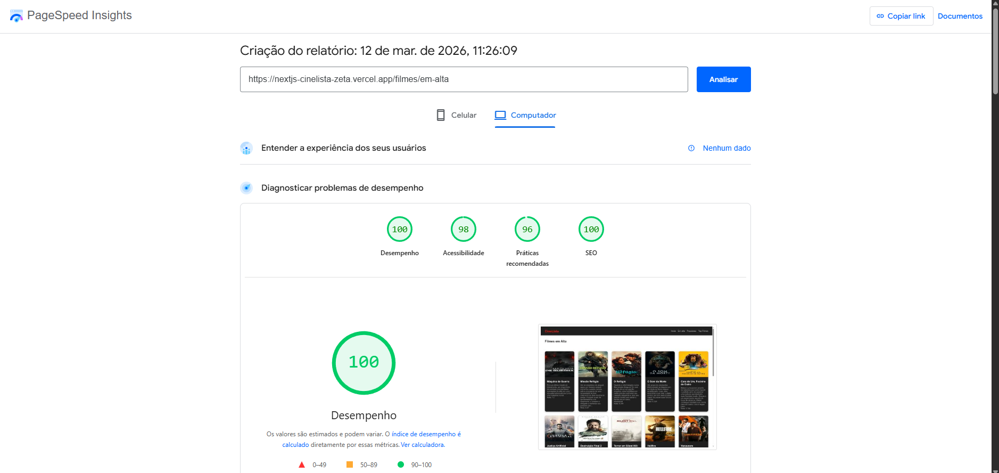
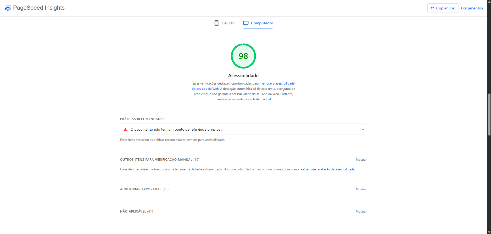
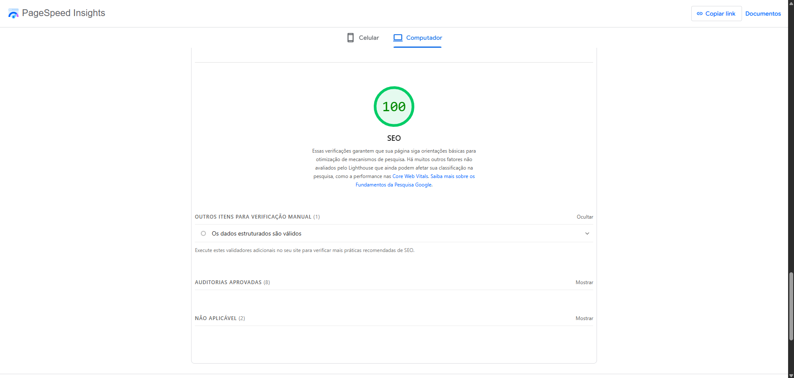

# CineLista — Otimização de Performance

---

## Descrição do Projeto

Este projeto consiste em uma aplicação web desenvolvida com **Next.js** e **TypeScript** que consome a API do **TMDB (The Movie Database)** para exibir um catálogo de filmes em destaque.

A aplicação apresenta uma lista de filmes com **poster, título, descrição resumida e avaliação**, além de permitir a navegação para páginas individuais com mais detalhes sobre cada filme.

O objetivo desta atividade foi **analisar e otimizar o desempenho da aplicação**, utilizando ferramentas como **PageSpeed Insights e Lighthouse**, aplicando técnicas de otimização de imagens, melhoria de estrutura semântica e redução de recursos desnecessários.

---

## Tecnologias Utilizadas

- **Next.js**
- **React**
- **TypeScript**
- **TMDB API**
- **CSS Modules**
- **Vercel (Deploy)**
- **PageSpeed Insights / Lighthouse**

---

## Gargalos Identificados

A análise inicial utilizando **PageSpeed Insights** indicou alguns pontos de melhoria relacionados à performance e boas práticas:

- Imagens maiores do que o necessário no grid de filmes.
- Proporção incorreta de alguns posters.
- Falta de prioridade para a imagem principal responsável pelo **LCP (Largest Contentful Paint)**.
- Estrutura semântica incompleta (ausência da landmark `<main>`).

---

## Melhorias Aplicadas

### Otimização de imagens

- Utilização do componente **`next/image`** para otimização automática.
- Redimensionamento dos posters exibidos no grid para **185x278**.
- Uso de **lazy loading automático** para imagens fora da área inicial da página.
- Definição da propriedade **`priority`** para a imagem responsável pelo **LCP**.

---

### Correção da proporção das imagens

Os posters da API do TMDB possuem proporção aproximada de **2:3**.

Foi ajustada a proporção exibida no layout para evitar deformações e melhorar a renderização.

---

### Redução do tamanho das imagens

- Substituição do tamanho `w300` por `w185` para posters exibidos no grid.
- Uso de imagens maiores apenas na página de detalhes do filme.

Essa alteração reduziu o peso total de download das imagens.

---

### Estrutura semântica da página

Foi adicionada a tag **`<main>`** envolvendo o conteúdo principal da página, melhorando:

- Acessibilidade
- Navegação por leitores de tela
- Conformidade com recomendações do Lighthouse

---

### Otimização do build

O projeto utiliza o **build de produção do Next.js**, que aplica automaticamente:

- Minificação de JavaScript
- Otimização de CSS
- Remoção de código redundante
- Divisão automática de código (code splitting)

---

## Comparação Antes e Depois

### Antes da Otimização









---

### Depois da Otimização


---

## Resultados Obtidos

Após as otimizações aplicadas, a aplicação apresentou os seguintes resultados no **PageSpeed Insights / Lighthouse**:

| Métrica        | Resultado |
| -------------- | --------- |
| Performance    | **100**   |
| Accessibility  | **100**   |
| Best Practices | **100**   |
| SEO            | **100**   |

### Principais fatores que contribuíram para a melhoria

- Otimização e redimensionamento das imagens
- Uso do componente `next/image`
- Prioridade na imagem responsável pelo **LCP**
- Estrutura semântica correta da página
- Redução do tamanho de recursos carregados

---

## Deploy

A aplicação está publicada na **Vercel**:

https://nextjs-cinelista-zeta.vercel.app

---

## Como Executar o Projeto

Clone o repositório:

```bash
git clone https://github.com/paulorocha-dev/nextjs-cinelista.git
```

Entre na pasta do projeto:

```bash
cd cinelista
```

Instale as dependências:

```bash
npm install
```

Execute o servidor de desenvolvimento:

```bash
npm run dev
```

Abra no navegador:

http://localhost:3000
